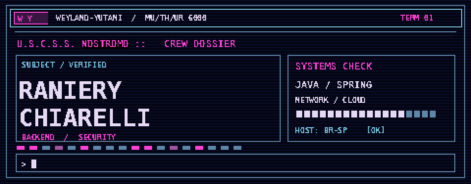

  

<h1 align="center">👋 Olá, eu sou o Raniery!</h1>

  <strong>Desenvolvedor backend em formação · Java &amp; Spring Boot · Segurança de aplicações</strong>

  
  
  

  

---

## 🧑‍💻 Sobre mim

Sou estudante de **Análise e Desenvolvimento de Sistemas na Fatec Ribeirão Preto**. Meu foco é desenvolvimento backend, especialmente com **Java e Spring Boot**. Gosto de entender como as coisas funcionam por dentro: da modelagem de dados à autenticação, das regras de negócio à segurança de uma API.

Também construo ferramentas com **Go** e **Python** e estudo redes, cibersegurança e computação em nuvem. Aqui no GitHub, você vai encontrar projetos de estudo e trabalhos acadêmicos que mostram esse caminho na prática.

- 🔐 **O que mais me interessa:** segurança de aplicações, autenticação e arquitetura de APIs.
- 🛠️ **Como gosto de aprender:** construindo, testando, documentando e melhorando projetos reais.
- 🎻 **Fora do código:** cinema, livros, música e minhas primeiras aventuras no violoncelo.

---

## 🧰 Tecnologias e ferramentas

**Linguagens e backend**

  
  
  
  

**Dados, infraestrutura e fluxo de trabalho**

  
  
  
  

**Estudando mais a fundo:** Spring Security · redes · segurança ofensiva e defensiva · Google Cloud.

---

## 🚀 Projetos em destaque

### 🛡️ [Auth-Guard](https://github.com/Ranyko/Auth-Guard)

API de autenticação e autorização feita para praticar segurança no ecossistema Java. Inclui cadastro e login, senhas protegidas com BCrypt, tokens JWT, controle de acesso por papéis e validação de entradas. O ambiente de desenvolvimento utiliza PostgreSQL e Docker.

`Java` `Spring Boot` `Spring Security` `JWT` `PostgreSQL` `Docker`

### 🔑 [Pswrd Checker](https://github.com/Ranyko/pswrd-checker)

Ferramenta de linha de comando em Go para avaliar a força de senhas e verificar se aparecem em vazamentos conhecidos. A consulta à API do Have I Been Pwned usa *k-anonymity*: a senha não é enviada ao serviço. O processamento em lote explora goroutines e canais.

`Go` `CLI` `APIs HTTP` `Concorrência` `Segurança`

### 📚 [Biblioteca Viva](https://github.com/Ranyko/Biblioteca-viva)

Projeto acadêmico em equipe para a gestão de uma biblioteca comunitária. Participei da modelagem de dados e da documentação; o repositório reúne o planejamento das funcionalidades, o esquema PostgreSQL e o protótipo. **A aplicação está em desenvolvimento.**

`Modelagem de dados` `PostgreSQL` `Docker` `Java e Spring Boot planejados`

### 🕹️ [Arcade Python](https://github.com/Ranyko/Arcade-Python)

Aplicativo de jogos de tabuleiro com interface em KivyMD. Reúne Jogo da Velha e Connect 4, com lógica organizada em MVC, opção de jogar contra o computador e suporte a salvar partidas.

`Python` `KivyMD` `MVC` `Jogos`

---

## 📖 O que venho explorando

| Tema | Por que me interessa |
| --- | --- |
| **Segurança de aplicações** | Entender autenticação, autorização, validação e como reduzir riscos desde o desenho da API. |
| **Redes e cibersegurança** | Conhecer a infraestrutura e os protocolos por trás dos sistemas que desenvolvo. |
| **Cloud e infraestrutura** | Aprender a preparar ambientes, executar serviços em containers e estudar recursos do Google Cloud. |

---

## 📊 GitHub em números

  
  

---

  <strong>Gostou de algum projeto?</strong> Explore os repositórios e acompanhe o que estou construindo por aqui. 🙂

